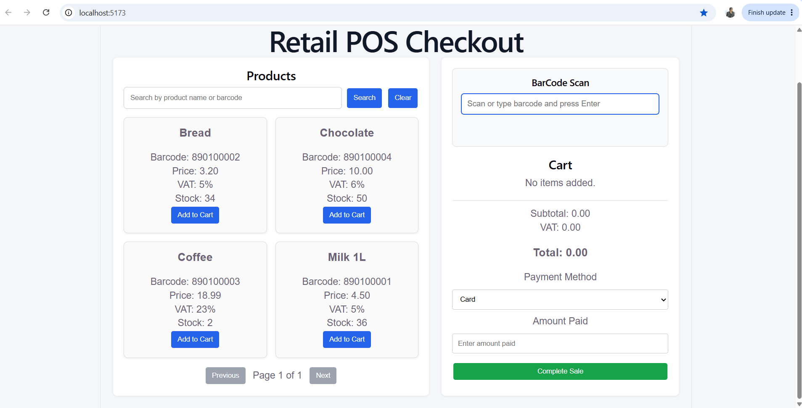
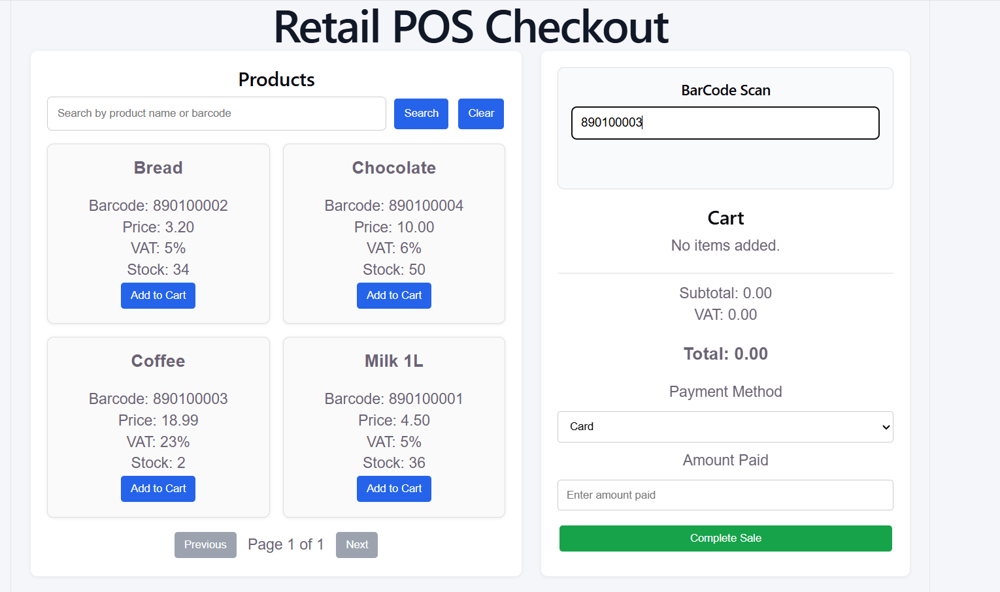
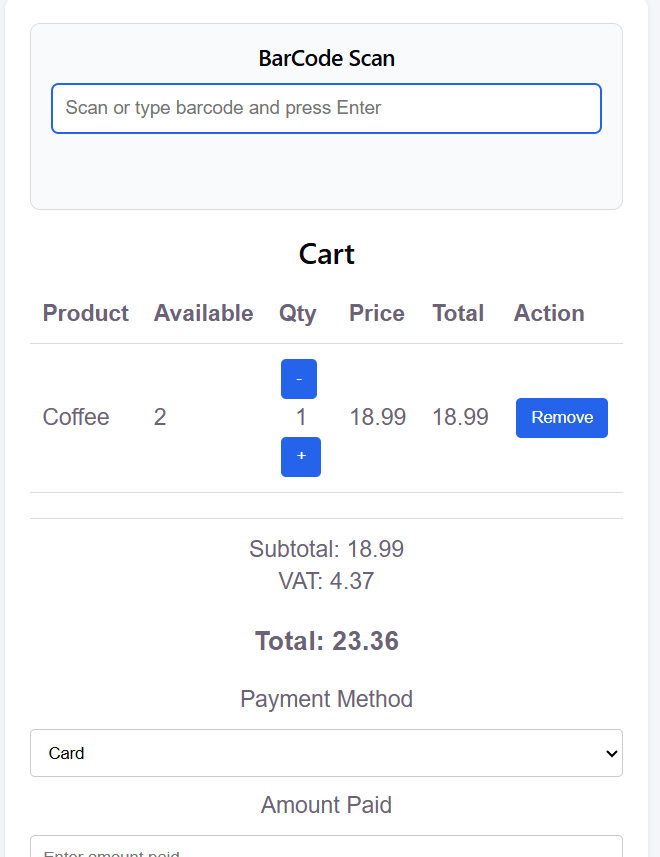
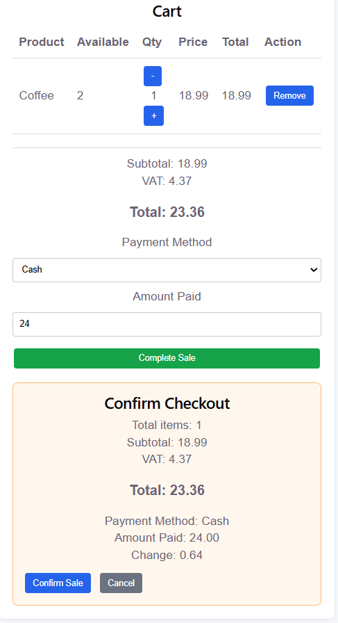
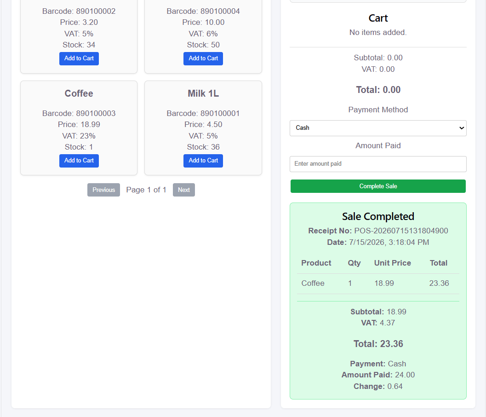
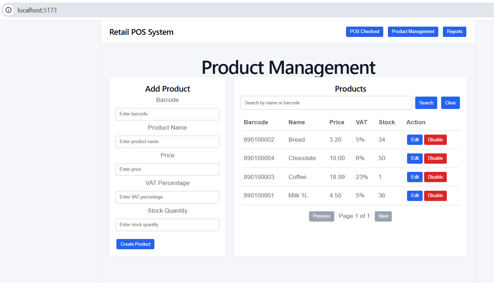
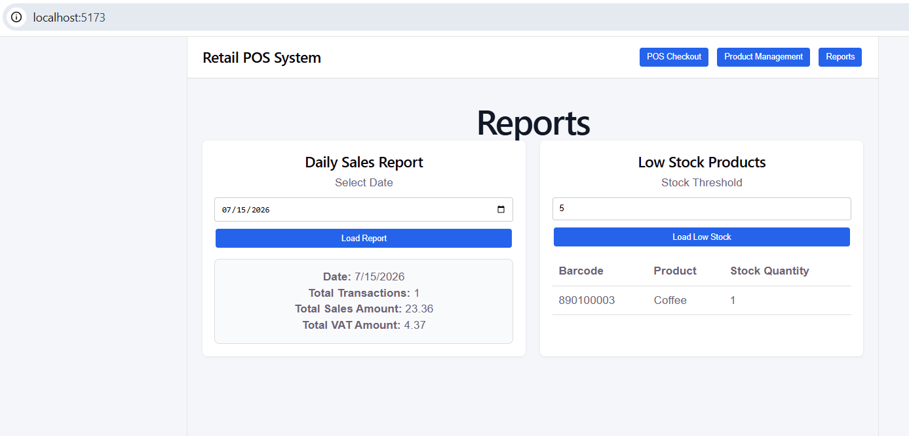
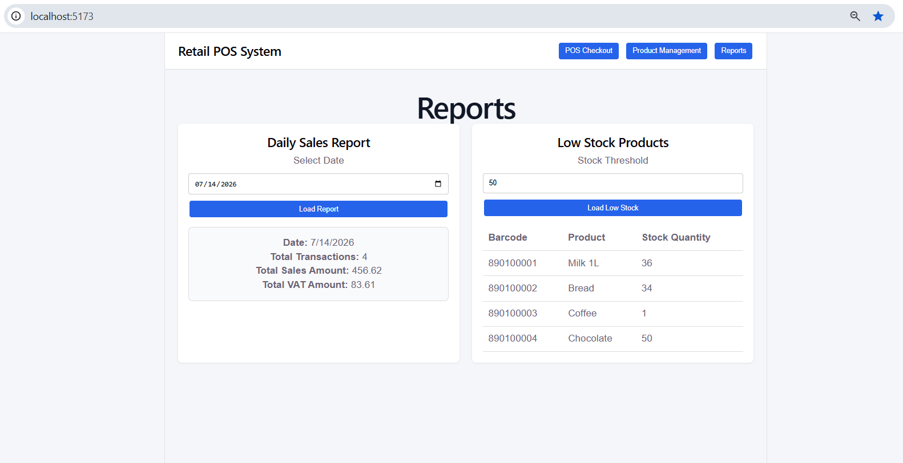

# Retail POS Frontend

React frontend for a Retail POS Management System built for cashier checkout, product management, barcode scanning, and reporting.

This frontend connects to the ASP.NET Core Web API backend.

## Related Backend Repository

Backend API repository:

```text
https://github.com/DeviPriyaAnbalagan/retail-pos-management-system
```

## Project Purpose

The goal of this project is to demonstrate a realistic retail POS workflow using React and .NET backend APIs.

It includes:

- POS checkout screen
- Product search with backend pagination
- Barcode quick scan
- Cart validation
- Checkout confirmation
- Receipt view
- Product management
- Reports screen

## Tech Stack

- React
- Vite
- JavaScript
- CSS
- Fetch API
- ASP.NET Core Web API backend
- SQL Server backend database

## Main Features

### POS Checkout

- Search products by name or barcode
- Backend paginated product search
- Add products to cart
- Increase/decrease quantity
- Stock limit validation
- Barcode quick scan input
- Payment method selection
- Amount paid validation
- Checkout confirmation
- Receipt display

### Product Management

- Create product
- Update product
- Search products
- Paginated product list
- Disable product using soft delete

### Reports

- Daily sales report
- Low-stock product report
- Date filter
- Stock threshold filter

## Backend Integration

This frontend calls the backend APIs:

```text
GET    /api/products/search
GET    /api/products/barcode/{barcode}
POST   /api/products
PUT    /api/products/{id}
DELETE /api/products/{id}
POST   /api/sales
GET    /api/reports/daily-sales
GET    /api/reports/low-stock
```

## Important Design Decisions

### Backend Search Instead of Frontend Filtering

Product search is handled by the backend using search text, page number, and page size. This avoids loading all products into the browser and improves scalability.

### Barcode Quick Scan

Barcode scanner input is handled using keyboard Enter event. React calls the backend barcode API and adds the product directly to cart.

### Stock Validation

React checks stock before adding products to cart, but backend performs final stock validation during checkout. This protects against stale frontend stock data.

### Checkout Confirmation

Before creating a sale, the cashier can review total amount, payment method, amount paid, and change.

### Soft Delete

Product disable uses soft delete in the backend. Disabled products are hidden from future sales but remain in the database for historical sales records.

## How to Run

### 1. Run Backend

```bash
cd "C:\Users\Devi Priya\source\repos\RetailPosSystem"
dotnet run
```

Backend should run on:

```text
http://localhost:5145
```

### 2. Run Frontend

```bash
cd "C:\Users\Devi Priya\source\repos\retail-pos-frontend"
npm install
npm run dev
```

Frontend should run on:

```text
http://localhost:5173
```

## Screens

- POS Checkout
- Product Management
- Reports

## Summary

This React frontend demonstrates how a cashier-facing POS application can interact with a .NET backend. It includes barcode lookup, backend product search, pagination, cart validation, checkout confirmation, receipt display, product management, and reports.

The backend remains the source of truth for price, VAT, stock, receipt number, and sales creation.

## Screenshots

### POS Checkout



### Barcode Quick Scan




### Checkout Confirmation



### Receipt View



### Product Management



### Reports



